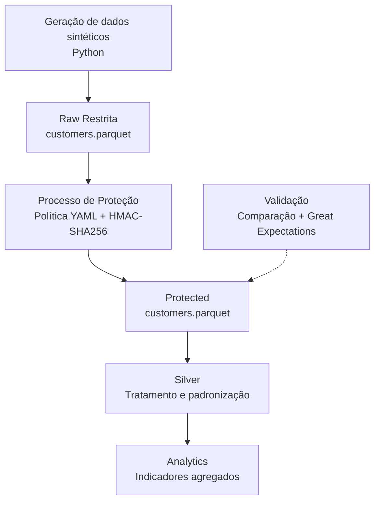

# Arquitetura da Solução — LGPD e Segurança Aplicada à Engenharia de Dados

## 1. Visão Geral

Este documento apresenta a arquitetura do case prático desenvolvido
como parte do PDI de LGPD e Segurança aplicada à Engenharia de Dados.

A solução utiliza dados sintéticos de clientes para demonstrar
a identificação, classificação, proteção e disponibilização
de dados em uma arquitetura organizada por camadas.

O fluxo proposto é:

Raw Restrita → Proteção → Silver → Analytics

A implementação atual contempla a geração dos dados, a camada Raw,
o processamento de proteção, a camada Protected e sua validação.

As camadas Silver e Analytics representam as próximas etapas
de desenvolvimento.

---

## 2. Objetivo do Case

O objetivo é demonstrar como incorporar requisitos de privacidade
e segurança ao ciclo de vida dos dados em um pipeline de
Engenharia de Dados.

O case busca:

- Identificar e classificar dados pessoais e sensíveis;
- Aplicar minimização e mecanismos de proteção;
- Separar dados originais de dados preparados para consumo;
- Definir requisitos de controle de acesso;
- Validar as transformações executadas;
- Produzir informações analíticas compatíveis com a finalidade;
- Documentar limitações e oportunidades de evolução.

---

## 3. Finalidade Analítica

O cenário considera uma empresa fictícia de e-commerce.

A finalidade analítica proposta é produzir indicadores comerciais
agregados para compreender características gerais da base de
clientes e seu comportamento de compra.

Entre os possíveis indicadores estão:

- Quantidade de clientes;
- Receita total;
- Ticket médio;
- Frequência de compra;
- Distribuição por faixa etária;
- Distribuição por faixa de renda;
- Indicadores por região.

A seleção final dos indicadores dependerá dos atributos
disponíveis no dataset e do contrato definido para a Silver.

A camada Analytics deve evitar a disponibilização de
identificadores individuais desnecessários.

---

## 4. Diagrama da Arquitetura



A camada Protected é uma saída intermediária explícita do
processo de proteção.

Ela permanece separada da Silver para distinguir as
transformações de privacidade das transformações analíticas.

---

## 5. Responsabilidades das Camadas

### 5.1 Raw Restrita

**Status:** Implementada.

**Local:**

`data/raw/customers.parquet`

A Raw armazena os registros sintéticos originais, antes da
aplicação das regras de proteção.

Características:

- 10.000 registros;
- 24 colunas;
- Identificadores diretos;
- Atributos pessoais sensíveis;
- Dados necessários para demonstrar o processo de proteção.

O acesso à Raw deve ser restrito conforme a matriz de
permissões proposta.

A denominação "Restrita" representa a classificação e o
requisito de acesso da camada. Ela não significa que permissões
efetivas tenham sido aplicadas ao diretório local.

### 5.2 Processo de Proteção

**Status:** Implementado.

O processo lê a Raw e aplica a política definida em:

`config/data_classification.yaml`

As ações incluem:

- Remoção de atributos;
- Pseudonimização com HMAC-SHA256;
- Generalização;
- Preservação de campos necessários.

O processamento é executado por:

`src/protect_data.py`

As regras são detalhadas em:

`docs/protection-rules.md`

### 5.3 Protected

**Status:** Implementada.

**Local:**

`data/protected/customers.parquet`

A Protected contém o resultado da aplicação das regras
de proteção.

Características:

- 10.000 registros;
- 17 colunas;
- Ausência dos sete atributos removidos;
- Identificador de cliente pseudonimizado;
- Atributos selecionados generalizados.

A Protected não deve ser considerada anônima.

Ela permanece sujeita aos requisitos de proteção aplicáveis
aos dados pessoais pseudonimizados.

### 5.4 Silver

**Status:** Planejada.

**Local previsto:**

`data/silver/customers.parquet`

A Silver será responsável por preparar os dados protegidos
para as finalidades analíticas definidas.

As transformações previstas incluem:

- Seleção dos atributos necessários;
- Padronização de tipos;
- Validação de domínios;
- Tratamento de inconsistências;
- Criação de atributos derivados.

O contrato de dados e as regras finais da Silver deverão ser
definidos antes da implementação.

### 5.5 Analytics

**Status:** Planejada.

A Analytics será responsável pela disponibilização dos
produtos analíticos do case.

As saídas previstas incluem indicadores comerciais agregados,
sem exposição desnecessária de identificadores individuais.

A definição dos agrupamentos deverá considerar o risco de
identificação indireta, especialmente em grupos com poucos
registros.

A agregação não deve ser apresentada automaticamente como
anonimização irreversível.

---

## 6. Fluxo de Processamento

### 6.1 Geração

O script `src/generate_data.py` produz o dataset sintético
utilizado no case.

A saída é armazenada na Raw.

### 6.2 Classificação

A classificação é definida em:

`config/data_classification.yaml`

A política estabelece o tratamento esperado para cada atributo.

### 6.3 Proteção

O script `src/protect_data.py` aplica as transformações
configuradas e gera a Protected.

### 6.4 Validação

O script `src/validate_protection.py` verifica a conformidade
da Protected com as regras implementadas.

A validação combina comparação entre datasets e expectativas
de qualidade com Great Expectations.

### 6.5 Preparação Analítica

Etapa planejada para a construção da Silver.

### 6.6 Disponibilização Analítica

Etapa planejada para a construção da Analytics.

---

## 7. Componentes e Tecnologias

| Tecnologia | Utilização |
|---|---|
| Python | Geração, proteção e validação dos dados. |
| Pandas | Manipulação e transformação dos datasets. |
| Parquet | Armazenamento das camadas de dados. |
| PyYAML | Leitura da política de classificação. |
| HMAC-SHA256 | Pseudonimização do identificador de cliente. |
| python-dotenv | Carregamento da configuração de ambiente. |
| Great Expectations | Validação da camada Protected. |
| Markdown | Documentação técnica e de governança. |

O case utiliza processamento local.

A adoção de serviços de nuvem, controle de acesso gerenciado
e orquestração não faz parte da implementação atual.

---

## 8. Segurança e Governança

### 8.1 Classificação e Minimização

A classificação é definida no documento:

`docs/data-classification.md`

A política técnica é mantida em:

`config/data_classification.yaml`

A minimização ocorre inicialmente no processo Raw → Protected
e deverá ser reavaliada nas camadas posteriores.

### 8.2 Controle de Acesso

A matriz de acesso por profissão está documentada em:

`docs/security/access_control.md`

Ela contempla Engenharia de Dados, Administração de Banco de
Dados, Ciência de Dados e Análise de Negócios.

As permissões representam uma proposta para a arquitetura.

O armazenamento local não possui, até esta etapa, um mecanismo
de autorização implementado especificamente pelo projeto.

### 8.3 Gerenciamento de Segredos

A chave utilizada na pseudonimização é fornecida por
configuração de ambiente.

Ela não deve ser incorporada ao código-fonte nem versionada
no repositório.

Uma implantação corporativa deverá considerar um mecanismo
apropriado de gerenciamento de segredos.

### 8.4 Rastreabilidade

A validação do pipeline produz evidências da execução das
regras de proteção.

Isso não equivale a uma trilha completa de auditoria de acesso.

Em produção, devem ser considerados registros de identidade,
recurso, operação, horário e resultado do acesso.

### 8.5 Retenção e Descarte

A retenção deve considerar a finalidade de cada camada.

O case documenta diretrizes de conservação e descarte, mas
não implementa políticas automatizadas de ciclo de vida.

Prazos e procedimentos operacionais devem ser definidos
conforme os requisitos de uma eventual implantação.

---

## 9. Qualidade e Validação

A validação implementada verifica a transformação Raw → Protected.

São avaliados:

- Quantidade de registros;
- Esquema esperado;
- Ausência de atributos removidos;
- Preservação de valores;
- Resultado das transformações;
- Regras de qualidade configuradas.

A última execução registrada concluiu com sucesso:

```text
GREAT EXPECTATIONS VALIDATION SUCCESSFUL
PROTECTION VALIDATION SUCCESSFUL
```

Essas validações demonstram conformidade com as regras
implementadas, mas não comprovam anonimização irreversível
nem a efetividade de controles de acesso ao armazenamento.

---

## 10. Estado de Implementação

| Componente | Estado |
|---|---|
| Geração de dados sintéticos | Implementado |
| Raw | Implementada |
| Política de classificação | Implementada |
| Processo de proteção | Implementado |
| Protected | Implementada |
| Validação da proteção | Implementada |
| Matriz de acesso | Documentada |
| Controle efetivo de acesso ao armazenamento | Não implementado |
| Silver | Planejada |
| Analytics | Planejada |
| Retenção e descarte automatizados | Não implementados |

---

## 11. Próximas Etapas

### 11.1 Construção da Silver

Definir o contrato de dados, as regras de transformação e
os atributos necessários para a finalidade analítica.

Implementar a leitura da Protected e a geração da Silver.

### 11.2 Construção da Analytics

Definir os indicadores comerciais e produzir tabelas
agregadas a partir da Silver.

Avaliar a necessidade de restringir agrupamentos com
poucos registros.

### 11.3 Consolidação do Case

Atualizar a documentação com:

- Esquemas finais das camadas;
- Regras de transformação;
- Resultados de execução;
- Evidências de validação;
- Limitações;
- Diagrama final da arquitetura.

---

## 12. Limitações

O projeto utiliza dados sintéticos e processamento local.

A aplicação de mecanismos de proteção demonstra conceitos
de LGPD e Segurança aplicada à Engenharia de Dados, mas não
substitui uma avaliação de risco de privacidade para dados reais.

A arquitetura documenta controles de acesso, rastreabilidade
e retenção que ainda não estão integralmente implementados.

A Protected contém dados pseudonimizados e não deve ser
classificada como anônima.

As camadas Silver e Analytics permanecem planejadas até
a conclusão de suas implementações.

---

## 13. Referências Internas

- `config/data_classification.yaml`
- `src/generate_data.py`
- `src/classify_data.py`
- `src/protect_data.py`
- `src/validate_protection.py`
- `docs/data-classification.md`
- `docs/protection-rules.md`
- `docs/security/access_control.md`