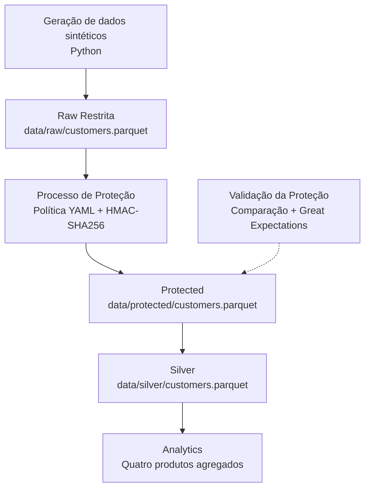

# Arquitetura da Solução — LGPD e Segurança Aplicada à Engenharia de Dados

## 1. Visão Geral

Este documento apresenta a arquitetura do case prático desenvolvido como parte do PDI de LGPD e Segurança aplicada à Engenharia de Dados.

A solução utiliza dados sintéticos de clientes de um e-commerce para demonstrar a classificação, proteção, preparação e disponibilização de dados em uma arquitetura organizada por camadas.

O pipeline implementado segue o fluxo:

**Raw Restrita → Proteção → Protected → Silver → Analytics**

O projeto é executado localmente, utilizando Python e arquivos Parquet.

---

## 2. Objetivo do Case

O objetivo é demonstrar como incorporar requisitos de privacidade e segurança ao ciclo de vida dos dados em um pipeline de Engenharia de Dados.

O case contempla:

- Identificação e classificação de dados pessoais e sensíveis;
- Definição de requisitos de proteção;
- Aplicação de minimização, pseudonimização e generalização;
- Validação automatizada das transformações;
- Preparação dos dados para consumo analítico;
- Geração de indicadores agregados;
- Documentação de requisitos de controle de acesso, retenção e rastreabilidade.

O dataset é sintético e foi gerado exclusivamente para fins de estudo.

---

## 3. Finalidade Analítica

O cenário considera uma empresa fictícia de e-commerce.

A finalidade analítica é produzir indicadores comerciais agregados para compreender características gerais da base de clientes e seu comportamento de compra.

Os indicadores disponibilizados incluem:

- Quantidade de clientes;
- Receita total;
- Quantidade de compras;
- Ticket médio;
- Distribuição por estado;
- Distribuição por faixa etária;
- Distribuição por faixa de renda;
- Distribuição por canal preferido.

A camada Analytics não disponibiliza identificadores individuais de clientes.

---

## 4. Diagrama da Arquitetura



A camada Protected é uma saída intermediária explícita do processo de proteção.

Sua separação da Silver permite distinguir as transformações de privacidade das transformações de preparação analítica.

---

## 5. Responsabilidades das Camadas

### 5.1 Raw Restrita

**Status:** Implementada.

**Local:**

`data/raw/customers.parquet`

A Raw armazena os registros sintéticos originais, antes da aplicação das regras de proteção.

Características:

- 10.000 registros;
- 24 colunas;
- Identificadores diretos;
- Atributos pessoais sensíveis;
- Dados utilizados para demonstrar o processo de proteção.

A denominação "Restrita" representa a classificação e o requisito de acesso da camada.

O projeto não implementa permissões específicas de armazenamento que impeçam o acesso direto aos arquivos por usuários que já possuam acesso ao diretório local.

### 5.2 Processo de Proteção

**Status:** Implementado.

O processo lê a Raw e aplica a política definida em:

`config/data_classification.yaml`

As ações incluem:

- Remoção de atributos;
- Pseudonimização com HMAC-SHA256;
- Generalização de atributos;
- Preservação de campos necessários.

O processamento é executado por:

`src/protect_data.py`

As regras são detalhadas em:

`docs/protection-rules.md`

### 5.3 Protected

**Status:** Implementada.

**Local:**

`data/protected/customers.parquet`

A Protected contém o resultado da aplicação das regras de proteção.

Características:

- 10.000 registros;
- 17 colunas;
- Ausência dos sete atributos removidos;
- Identificador de cliente pseudonimizado;
- Atributos selecionados generalizados.

A Protected não deve ser considerada anônima.

Ela permanece sujeita aos requisitos de proteção aplicáveis aos dados pessoais pseudonimizados.

### 5.4 Silver

**Status:** Implementada.

**Local:**

`data/silver/customers.parquet`

A Silver prepara os dados protegidos para a finalidade analítica do case.

Características:

- 10.000 registros;
- 12 colunas;
- Seleção dos atributos necessários;
- Conversão de datas;
- Validação de regras de consistência;
- Cálculo do ticket médio por cliente.

A Silver mantém o `customer_id` pseudonimizado para uso interno.

As regras são detalhadas em:

`docs/silver-rules.md`

### 5.5 Analytics

**Status:** Implementada.

**Local:**

`data/analytics/`

A Analytics disponibiliza produtos analíticos agregados, sem expor o identificador individual dos clientes.

Os quatro produtos implementados são:

| Produto | Dimensão | Grupos gerados |
|---|---|---:|
| `customers_by_state.parquet` | Estado | 27 |
| `customers_by_age.parquet` | Faixa etária | 6 |
| `customers_by_income.parquet` | Faixa de renda | 5 |
| `customers_by_channel.parquet` | Canal preferido | 4 |

Cada produto contém:

- Quantidade de clientes distintos;
- Receita total;
- Quantidade de compras;
- Ticket médio agregado.

Foi implementada uma regra de divulgação que exclui grupos com menos de 10 clientes.

Essa regra reduz a exposição de grupos pequenos, mas não garante anonimização irreversível.

As regras são detalhadas em:

`docs/analytics-rules.md`

---

## 6. Fluxo de Processamento

### 6.1 Geração

O script `src/generate_data.py` produz o dataset sintético utilizado no case.

A saída é armazenada na Raw.

### 6.2 Classificação

A classificação é definida em:

`config/data_classification.yaml`

A política estabelece o tratamento esperado para cada atributo.

### 6.3 Proteção

O script `src/protect_data.py` aplica as transformações configuradas e gera a Protected.

### 6.4 Validação da Proteção

O script `src/validate_protection.py` verifica a conformidade da Protected com as regras implementadas.

A validação combina comparação entre datasets e expectativas de qualidade com Great Expectations.

### 6.5 Preparação Analítica

O script `src/build_silver.py` lê a Protected, seleciona os atributos necessários, padroniza as datas, valida os dados e calcula o ticket médio.

A saída é armazenada na Silver.

### 6.6 Disponibilização Analítica

O script `src/build_analytics.py` lê a Silver e produz quatro tabelas agregadas.

As saídas são armazenadas na Analytics.

---

## 7. Componentes e Tecnologias

| Tecnologia | Utilização |
|---|---|
| Python | Geração, proteção, validação e processamento dos dados. |
| Pandas | Manipulação e transformação dos datasets. |
| Parquet | Armazenamento das camadas de dados. |
| PyYAML | Leitura da política de classificação. |
| HMAC-SHA256 | Pseudonimização do identificador de cliente. |
| python-dotenv | Carregamento da configuração de ambiente. |
| Great Expectations | Validação da camada Protected. |
| Markdown | Documentação técnica e de governança. |

O case utiliza processamento local.

Serviços de nuvem, orquestração e controle de acesso gerenciado não fazem parte da implementação atual.

---

## 8. Segurança e Governança

### 8.1 Classificação e Minimização

A classificação é definida em:

`docs/data-classification.md`

A política técnica é mantida em:

`config/data_classification.yaml`

A minimização ocorre no processo Raw → Protected e novamente na preparação da Silver.

Na Analytics, são disponibilizados apenas os atributos de agrupamento e os indicadores necessários à finalidade analítica.

### 8.2 Controle de Acesso

A matriz de acesso por profissão está documentada em:

`docs/security/access_control.md`

Ela contempla:

- Engenharia de Dados;
- Administração de Banco de Dados;
- Ciência de Dados;
- Análise de Negócios.

As permissões representam uma proposta para a arquitetura.

O armazenamento local não possui um mecanismo de autorização implementado especificamente pelo projeto.

### 8.3 Gerenciamento de Segredos

A chave utilizada na pseudonimização é fornecida por configuração de ambiente.

Ela não deve ser incorporada ao código-fonte nem versionada no repositório.

Uma implantação corporativa deverá considerar um mecanismo apropriado de gerenciamento de segredos.

### 8.4 Rastreabilidade

A execução dos scripts e das validações produz evidências técnicas do processamento.

Isso não equivale a uma trilha completa de auditoria de acesso.

Em produção, devem ser considerados registros de identidade, recurso, operação, horário e resultado do acesso.

### 8.5 Retenção e Descarte

A retenção deve considerar a finalidade de cada camada.

O case documenta diretrizes de conservação e descarte, mas não implementa políticas automatizadas de ciclo de vida.

Prazos e procedimentos operacionais devem ser definidos conforme os requisitos de uma eventual implantação.

### 8.6 Divulgação de Indicadores

A Analytics aplica um limite mínimo de 10 clientes por grupo.

Grupos abaixo desse limite não são publicados.

A regra não deve ser interpretada como garantia de anonimização, especialmente quando os resultados puderem ser combinados com outras fontes.

---

## 9. Qualidade e Validação

### 9.1 Protected

A validação verifica:

- Quantidade de registros;
- Esquema esperado;
- Ausência de atributos removidos;
- Preservação de valores;
- Resultado das transformações;
- Regras de qualidade configuradas.

A execução registrada concluiu com sucesso:

```text
GREAT EXPECTATIONS VALIDATION SUCCESSFUL
PROTECTION VALIDATION SUCCESSFUL
```

### 9.2 Silver

O processamento verifica:

- Presença das colunas obrigatórias;
- Ausência de identificadores nulos;
- Unicidade do identificador;
- Ausência de valores nulos nas métricas comerciais;
- Ausência de valores negativos nas métricas comerciais;
- Conversão das colunas de data.

A execução registrada produziu 10.000 registros e 12 colunas.

### 9.3 Analytics

O processamento verifica o esquema de entrada e os atributos utilizados nas agregações.

Os quatro produtos foram gerados e lidos com sucesso.

As saídas não incluem o identificador individual de cliente.

---

## 10. Estado de Implementação

| Componente | Estado |
|---|---|
| Geração de dados sintéticos | Implementado |
| Raw | Implementada |
| Política de classificação | Implementada |
| Processo de proteção | Implementado |
| Protected | Implementada |
| Validação da proteção | Implementada |
| Silver | Implementada |
| Analytics | Implementada |
| Matriz de acesso | Documentada |
| Controle efetivo de acesso ao armazenamento | Não implementado |
| Retenção e descarte automatizados | Não implementados |
| Auditoria completa de acesso | Não implementada |

---

## 11. Limitações

O projeto utiliza dados sintéticos e processamento local.

A aplicação de mecanismos de proteção demonstra conceitos de LGPD e Segurança aplicada à Engenharia de Dados, mas não substitui uma avaliação de risco de privacidade para dados reais.

A arquitetura documenta controles de acesso, rastreabilidade e retenção que não estão integralmente implementados.

A Protected e a Silver contêm dados pseudonimizados e não devem ser classificadas como anônimas.

A Analytics contém dados agregados e aplica uma regra mínima de grupo, mas não foi demonstrada anonimização irreversível.

---

## 12. Referências Internas

- `config/data_classification.yaml`
- `src/generate_data.py`
- `src/classify_data.py`
- `src/protect_data.py`
- `src/validate_protection.py`
- `src/build_silver.py`
- `src/build_analytics.py`
- `docs/data-classification.md`
- `docs/protection-rules.md`
- `docs/silver-rules.md`
- `docs/analytics-rules.md`
- `docs/security/access_control.md`
- `docs/pdi-evidence.md`